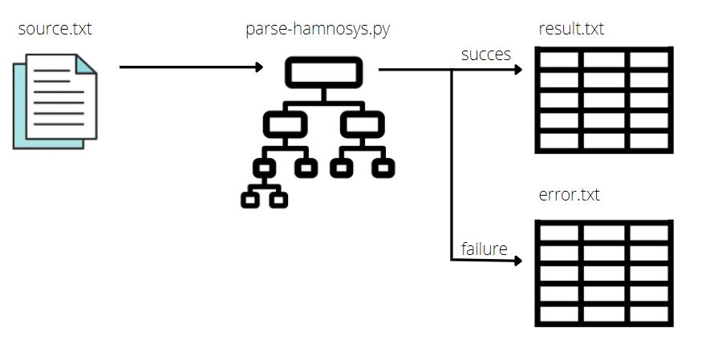
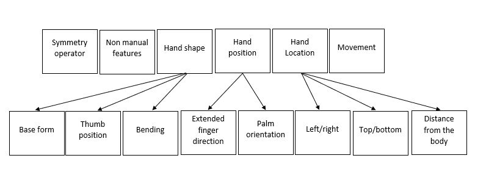
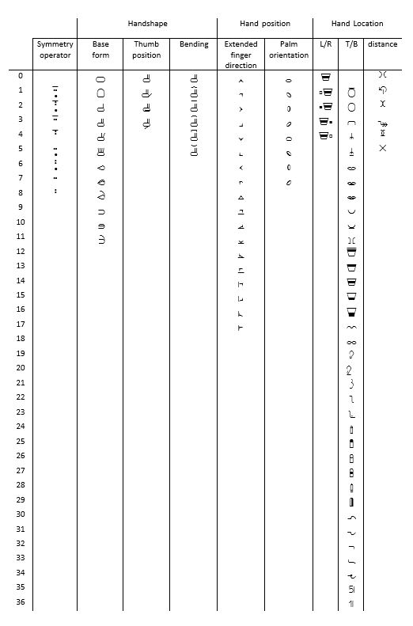

# parse-hamnosys



The main goal of the parser is to translate a label representing a SL gloss,
written in HamNoSys format, into a form that can be used for DL-based classification.
We used a decision tree to decompose the notation into numerical multilabels
for the defined classes.
The parser analyzes a series of symbols and matches each symbol with the class
that describes it (while assigning it the appropriate number) or removes it.

## Hamburg Sign Language Notation System

The Hamburg Sign Language Notation System (HamNoSys) is a _phonetic_ 
transcription system that has been widespread for more then 20 years.
HamNoSys does not refer to different national finger alphabets and
can therefore be used internationally.
It can be divided into six basic blocks, as presented
in the below Figure (upper panel).
The first two out of six blocks - symmetry operator and
non-manual features - are optional. The remaining four components - handshape,
hand position, hand location, and movement - are mandatory.
More detailed structure is also presented in the figure (lower panel).



### Font

HamNoSys font is required to be installed, to properly visualise provided examples.
It can be downloaded directly from
[DSG Corpus](https://www.sign-lang.uni-hamburg.de/dgs-korpus/index.php/hamnosys-97.html)
website.

## Parser classes

In our implementation, four blocks (symmetry operator, location left/right, location top/bottom, distance from the body) refer to the overall human posture, while five blocks (handshape base form, handshape thumb position, handshape bending, hand position extended finger direction, and hand position palm orientation) relate to a single hand.

List of blocks and their ranges:
* __Symmetry operator__ class consists of 9 symbols (0 to 8). 
* __Handshape - Baseform__ class consists of 12 symbols (0 to 11).
* __Handshape - Thumb position__ class consists of 4 symbols (0 to 3).
* __Handshape - bending__ class consists of 6 symbols (0 to 5). 
* __Handposition - Extended finger direction__ class consists of 18 symbols (0 to 17). 
* __Handposition - Palm orientation__ class consists of 8 symbols (0 to 7).
* __Handposition - Left/Right__ class consists of 5 symbols (0 to 4).
* __Handposition - Top/Bottom__ class consists of 37 symbols (0 to 36). 
* __Handposition - Distance__ class consists of 6 symbols (0 to 5).

The figure presents the numerical values and assigned to them HamNoSys symbols.


## Usage

In its most basic form, parsing new annotation file boils down to:

```
$ python parse-hamnosys.py -sf <source_file> -df <destination_file> -ef <error_file>
```

In repositry we prepared some example files, which were produced by running:

```
$ python parse-hamnosys.py -sf hamnosys_example.txt -df hamnosys_parsed.txt -ef error.txt
```

### Source file format

Default input file format is defined by the [HearAI](https://github.com/hearai/hearai) project requirements. As in [hamnosys_example.txt](hamnosys_example.txt) parser requires a file that has 6 columns separated with a space sign " ". Due to this, if any of the columns contains space, it must be removed or replaced (for example with "_" sign) before passing to the parser. Parsers operates only on HamNoSys notation, that is stored in the last (6th) column. It shall start with HamNoSys sign (No quote nor apostrophe sign is allowed).
Input file columns and description:
* Name - name of a video file that given notation refers to
* Start - sign start time (on a video)
* End - sign end time (on a vide)
* Dict - word number in a dictionary
* Word - translation to a spoken language
* Hamnosys - Notation 

### Destination File format

Default estination file consists of following columns separated by the space " " sign:
* Name - name of a video file that given notation refers to, directly copied from source file
* Start - sign start time (on a video), directly copied from source file
* End - sign end time (on a vide), directly copied from source file
* Symmetry operator - Number that represents one of the classes (please refer to hamnosys_dicts.txt), parsed from notation
* NonDom first - Used when notation starts with  sign
* Dominant - Handshape - Baseform - Number that represents one of the classes (please refer to hamnosys_dicts.txt), parsed from notation
* Dominant - Handshape - Thumb position - Number that represents one of the classes (please refer to hamnosys_dicts.txt), parsed from notation
* Dominant - Handshape - bending - Number that represents one of the classes (please refer to hamnosys_dicts.txt), parsed from notation
* Dominant - Handposition - extended finger direction - Number that represents one of the classes (please refer to hamnosys_dicts.txt), parsed from notation
* Dominant - Handposition - palm orientation - Number that represents one of the classes (please refer to hamnosys_dicts.txt), parsed from notation
* Dominant - Handshape - Baseform2
* Dominant - Handshape - Thumb position2
* Dominant - Handshape - Bending2
* Dominant - Handposition - Extended finger direction2
* Dominant - Handposition - Palm orientation2
* NONDominant - Handshape - Baseform
* NONDominant - Handshape - Thumb position
* NONDominant - Handshape - Bending
* NONDominant - Handposition - Extended finger direction
* NONDominant - Handposition - Palm orientation
* NONDominant - Handshape - Baseform2
* NONDominant - Handshape - Thumb position2
* NONDominant - Handshape - Bending2
* NONDominant - Handposition - Extended finger direction2
* NONDominant - Handposition - Palm orientation2
* Handposition - LR - Number that represents one of the classes (please refer to hamnosys_dicts.txt), parsed from notation
* Handposition - TB - Number that represents one of the classes (please refer to hamnosys_dicts.txt), parsed from notation
* Handposition - Distance - Number that represents one of the classes (please refer to hamnosys_dicts.txt), parsed from notation

## Acknowledgement

File `hamnosys_example.txt` was created using [Korpusowy słownik polskiego języka migowego](https://www.slownikpjm.uw.edu.pl/)

Joanna Łacheta, Małgorzata Czajkowska-Kisil, Jadwiga Linde-Usiekniewicz, Paweł Rutkowski (red.), 2016, Korpusowy słownik polskiego języka migowego, Warszawa: Wydział Polonistyki Uniwersytetu Warszawskiego, ISBN: 978-83-64111-49-5 (publikacja online).

## Read more
* [Introduction to HamNoSys](https://www.hearai.pl/post/4-hamnosys/)
* [Introduction to HamNoSys Part 2](https://www.hearai.pl/post/5-hamnosys2/)
